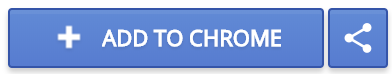
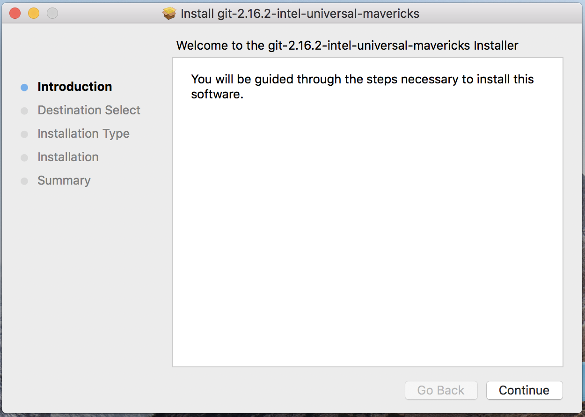
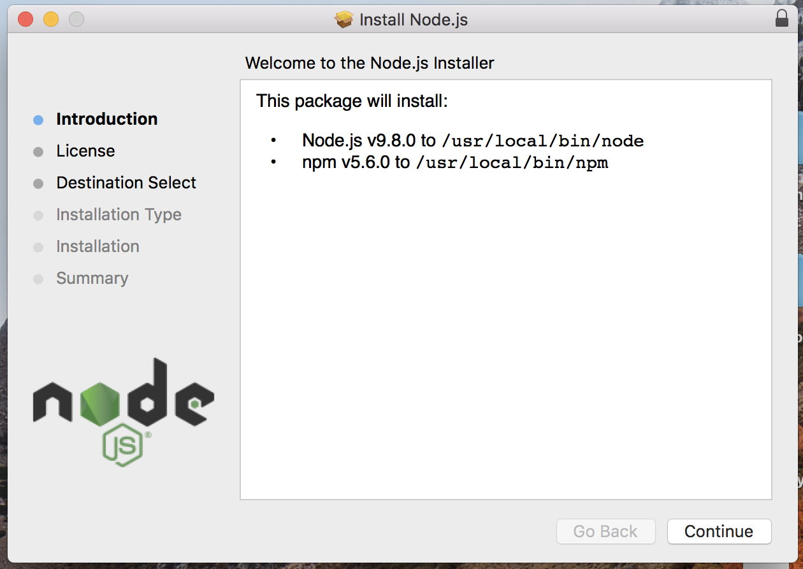

# Setup (macOS)

## Vereiste software

*   [Google Chrome](https://www.google.nl/chrome/index.html)
*   [React Developer Tools Chrome plugin](https://github.com/facebook/react-devtools)
*   [Git](https://git-scm.com)
*   [NodeJS](https://nodejs.org) (Minimale versie 8.9.0)
*   [Yarn](https://yarnpkg.com)
*   Your editor of choice (Tip: [VSCode](setup-vscode.md))

## Google Chrome

*   Download chrome [link](https://www.google.nl/chrome/index.html)
*   Open de installer en voltooi de installatie.

## React Developer Tools (Chrome plugin)

*   Open de installatielink in chrome [link](https://chrome.google.com/webstore/detail/react-developer-tools/fmkadmapgofadopljbjfkapdkoienihi)
*   Open de Add to Chrome knop  
    

## Git versiecontrole

*   Download git [link](https://git-scm.com/download/mac).
*   Open de installer en volg de stappen



## Node.js

*   Download node [link](https://nodejs.org)
*   Open de installer en volg de stappen



## De yarn package manager

*   Open **Terminal**, terug te vinden in de Application folder.
*   Voer het onderstaande commando in.

```
npm install --global yarn
```
