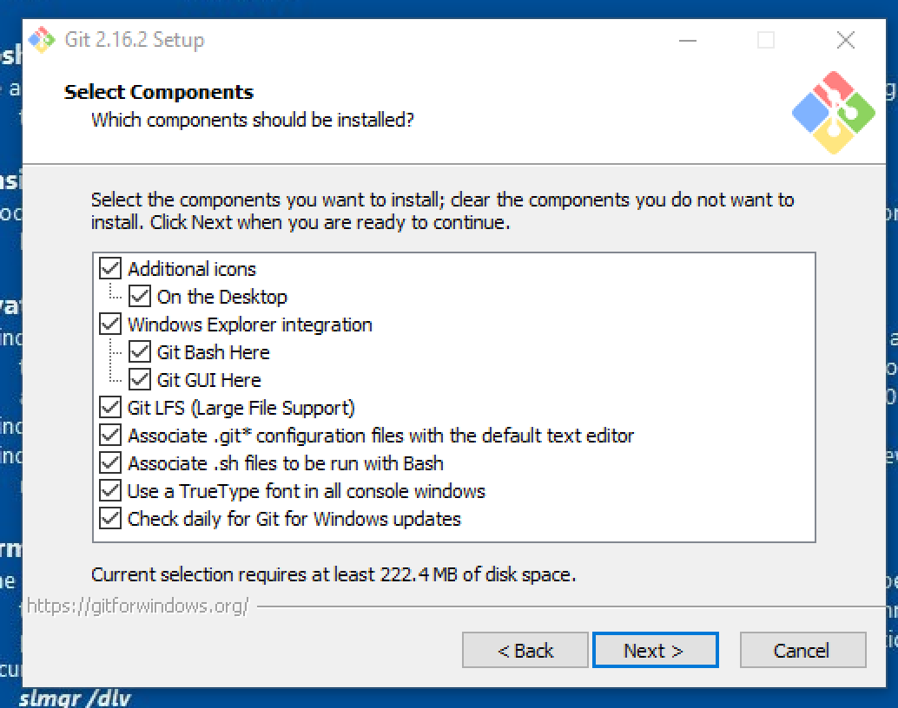
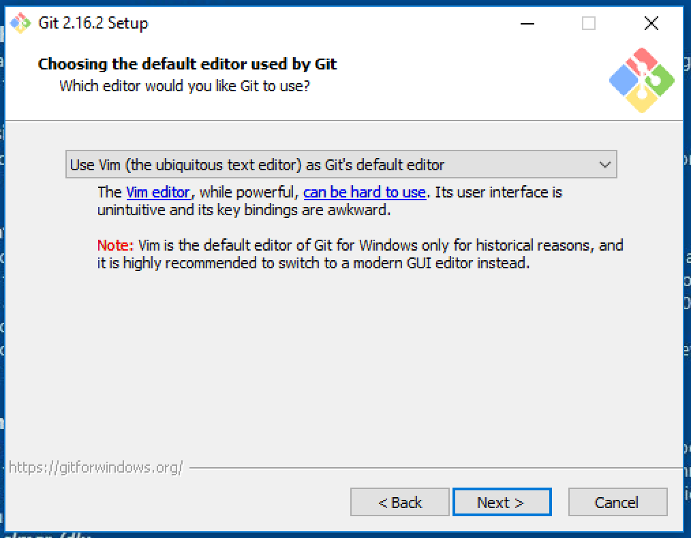
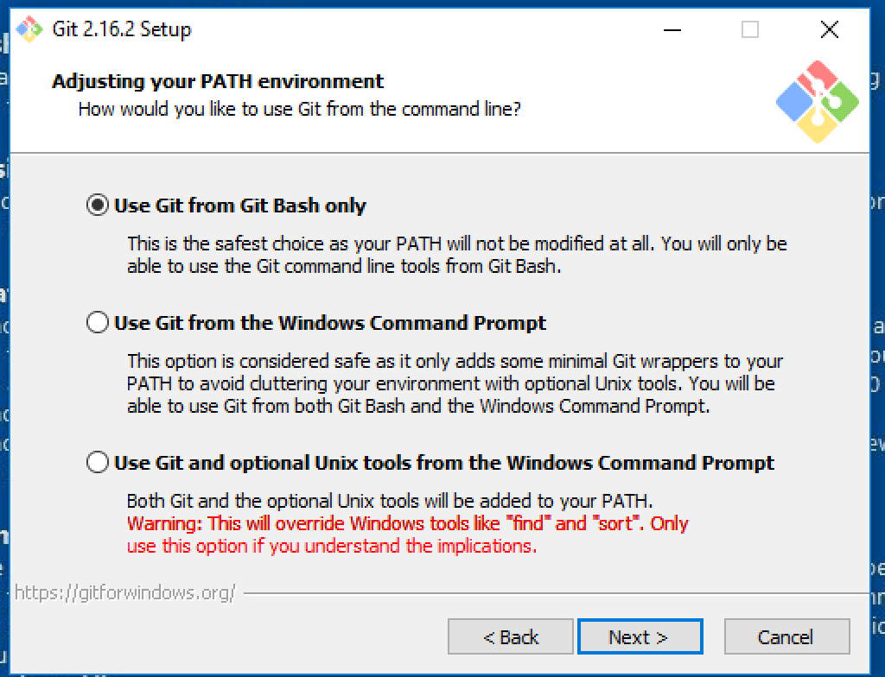
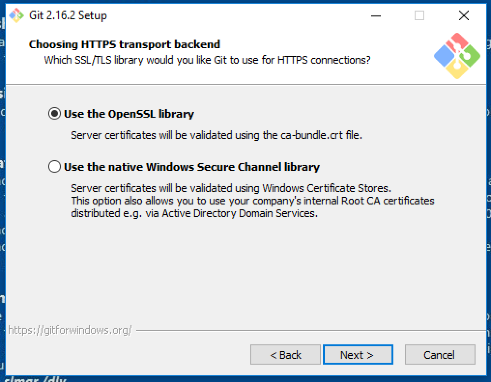
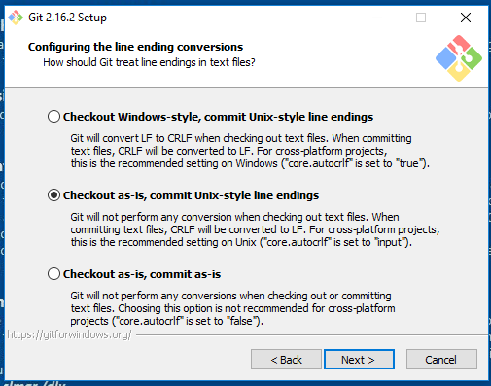
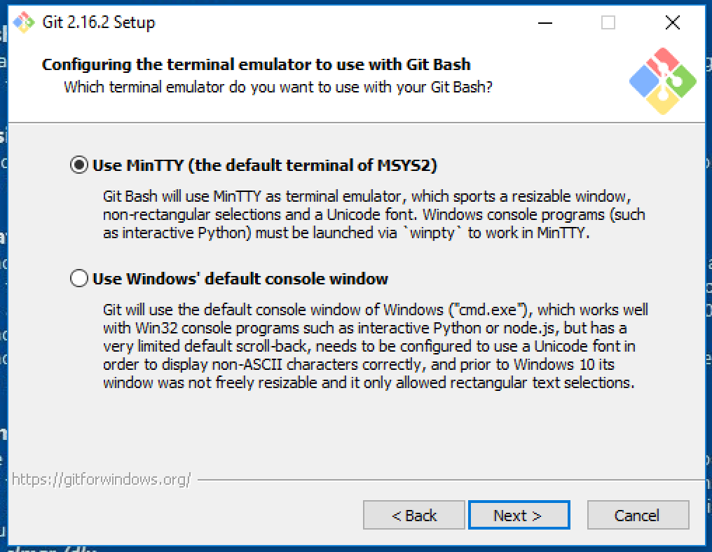
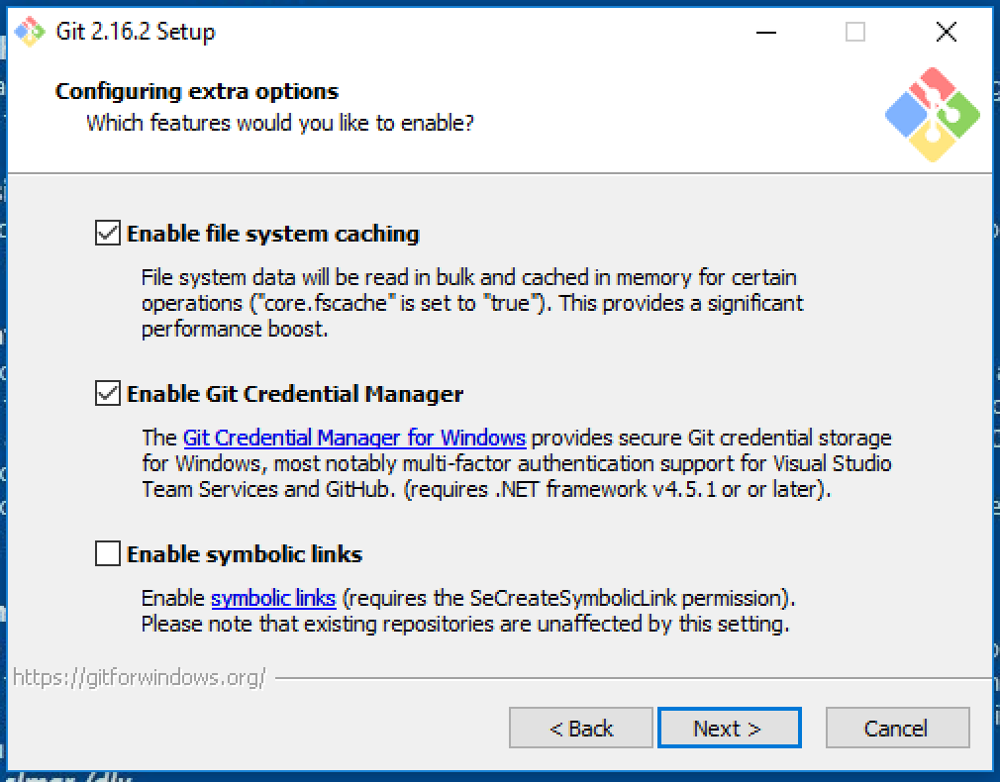
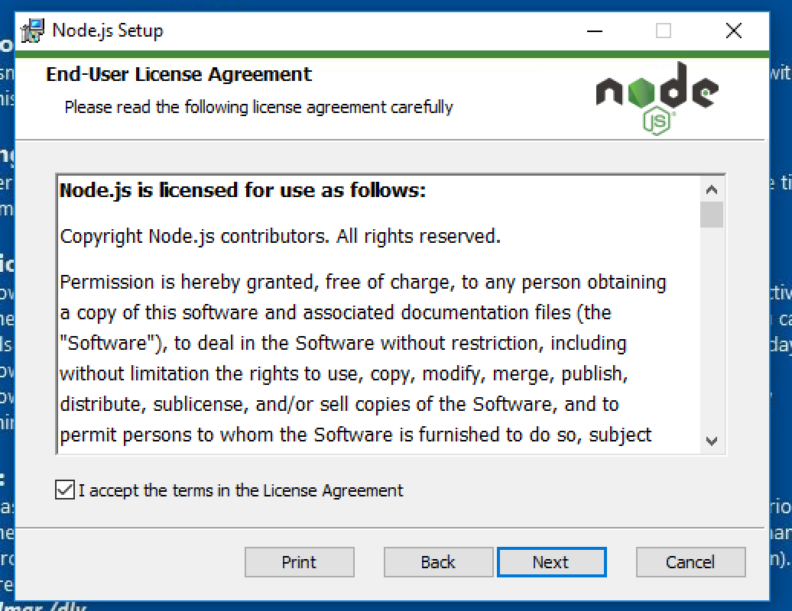
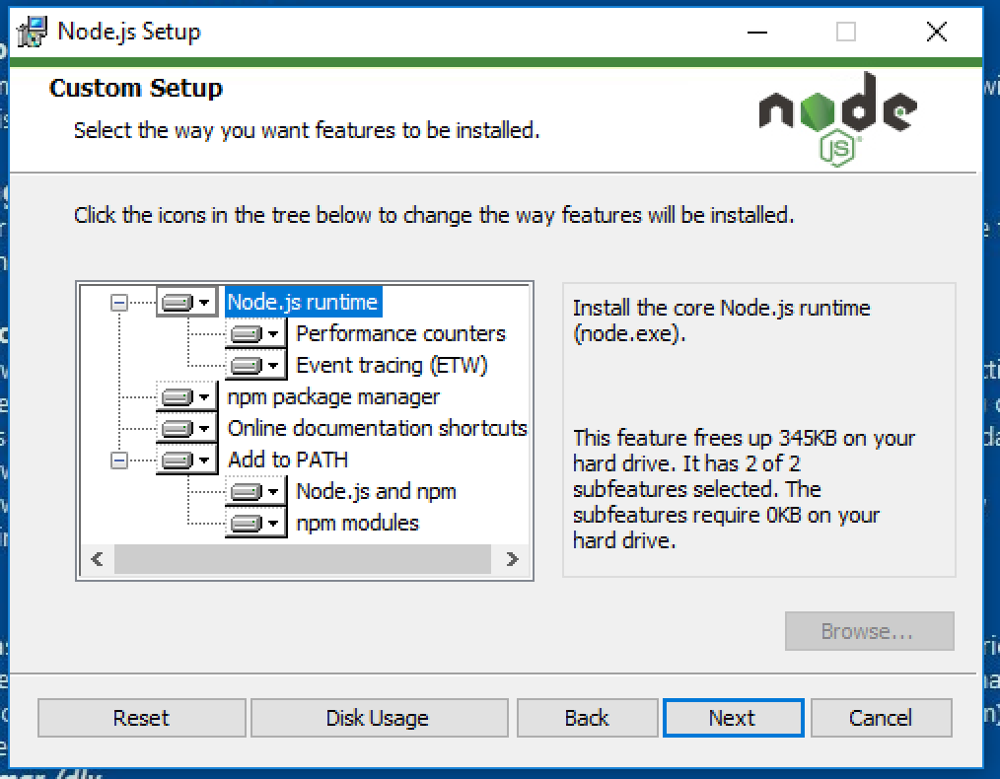
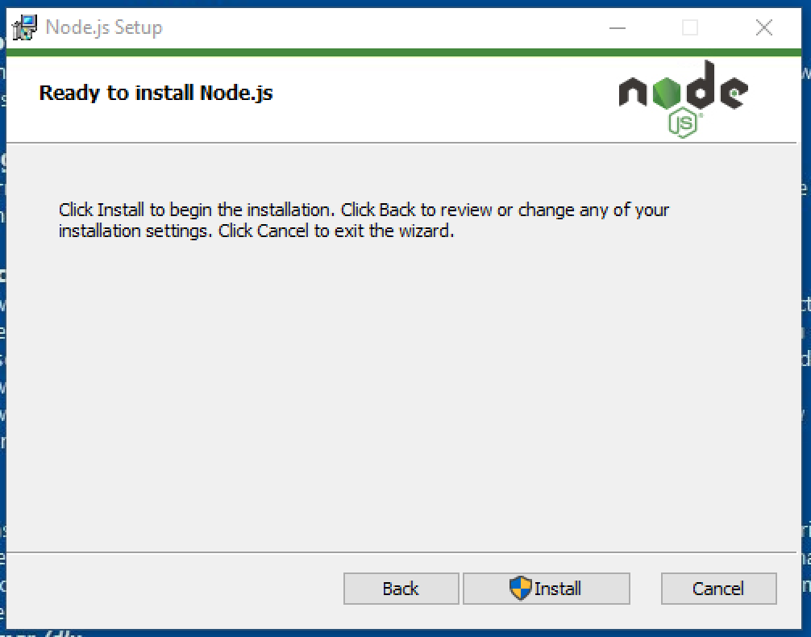

# Setup (Windows)

## Vereiste software

*   [Google Chrome](https://www.google.nl/chrome/index.html)
*   [React Developer Tools Chrome plugin](https://github.com/facebook/react-devtools)
*   [Git](https://git-scm.com)
*   [NodeJS](https://nodejs.org) (Minimale versie 8.9.0)
*   [Yarn](https://yarnpkg.com)
*   Your editor of choice (Tip: [VSCode](setup-vscode.md))

## Google Chrome

*   Download chrome [link](https://www.google.nl/chrome/index.html)
*   Open de installer en voltooi de installatie.

## React Developer Tools (Chrome plugin)

*   Open de installatielink in chrome [link](https://chrome.google.com/webstore/detail/react-developer-tools/fmkadmapgofadopljbjfkapdkoienihi)
*   Open de Add to Chrome knop  
    

## Git versiecontrole

*   Download git [link](https://git-scm.com/download/win).
*   Open de installer
*   Vink alle opties aan en druk op volgende



*   Selecteer **vim** als editor en druk op volgende



*   Selecteer **Use Git from Bash only** en druk op volgende



*   Selecteer **Use the OpenSSL library** optie en druk op volgende



*   Selecteer **Checkout as-is, commit Unix style line endings** en druk op volgende



*   Selecteer **Use MinTTY** en druk op volgende



*   Vink **File system caching** en **Git credentials manager** aan en druk op volgende.



*   Voltooi de installatie

## Node.js

*   Download node [link](https://nodejs.org)
*   Open de installer
*   Ga akkoord met de gebruikersvoorwaarden en druk op volgende



*   Vink alle opties aan en druk op volgende



*   Druk op installeren en voltooi de installatie



## De yarn package manager

*   Open **Git Bash**, terug te vinden op de Desktop.
*   Voer het onderstaande commando in.

```
npm install --global yarn
```
